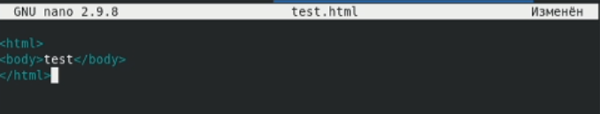

---
## Front matter
title: Лабораторная работа № 6. Мандатное разграничение прав в Linux
author: [Радикорский Павел Михайлович, НФИбд-03-18]
institute: "RUDN University, Moscow, Russian Federation"
date: 15.11.2021
lang: "ru"
## Formatting
toc: false
slide_level: 2
theme: metropolis
mainfont: PT Serif
romanfont: PT Serif
sansfont: PT Sans
monofont: Consolas
header-includes:
 - \metroset{progressbar=frametitle,sectionpage=progressbar,numbering=fraction}
 - '\makeatletter'
 - '\beamer@ignorenonframefalse'
 - '\makeatother'
aspectratio: 43
section-titles: true

---
# Цели и задачи

## Цель

Развить навыки администрирования ОС Linux. Получить первое практическое знакомство с технологией SELinux1. Проверить работу SELinx на практике совместно с веб-сервером Apache

# Выполнение

## Процесс выполнения

Вошли в систему с полученными учётными данными и убедились, что SELinux работает в режиме enforcing политики targeted с помощью команд getenforce и sestatus. Обратились с помощью консоли к веб-серверу, запущенному на вашем компьютере, запустили сервер
    
{ #fig:001 width=70% }

## Процесс выполнения

Нашли веб-сервер Apache в списке процессов, определили его контекст безопасности — unconfined_u, unconfined_r, unconfined_t
    
{ #fig:001 width=70% }

## Процесс выполнения

Посмотрите текущее состояние переключателей SELinux для Apache с помощью команды sestatus -b httpd

{ #fig:001 width=70% }

## Процесс выполнения

Посмотрели статистику по политике с помощью команды seinfo, также определили множество пользователей, ролей, типов

{ #fig:001 width=70% }

## Процесс выполнения

Определили тип файлов и поддиректорий, находящихся в директории /var/www

{ #fig:001 width=70% }

## Процесс выполнения

Создали от имени суперпользователя html-файл /var/www/html/test.html следующего содержания

{ #fig:001 width=70% }

## Процесс выполнения

Проверили контекст созданного вами файла. По умолчанию присваивается httpd_sys_content_t

{ #fig:001 width=70% }

## Процесс выполнения

Обратились к файлу через веб-сервер, введя в браузере адрес http://127.0.0.1/test.html. Убедились, что файл был успешно отображён

{ #fig:001 width=70% }

## Процесс выполнения

Проверили контекст файла, сопоставили их с контекстом файлов httpd

{ #fig:001 width=70% }

## Процесс выполнения

Изменили контекст файла /var/www/html/test.html с httpd_sys_content_t на samba_share_t, попробовали получить доступ к файлу, получили ошибку

{ #fig:001 width=70% }

## Процесс выполнения

Просмотрели log-файлы веб-сервера Apache. Также просмотрели системный лог-файл: tail /var/log/messages

{ #fig:001 width=70% }

## Процесс выполнения

Попробовали запустить веб-сервер Apache на прослушивание ТСР-порта 81. Для этого в файле /etc/httpd/httpd.conf нашли строчку Listen 80 и заменили её на Listen 81

{ #fig:001 width=70% }

## Процесс выполнения

Выполнили перезапуск сервера Apache, сбоя не произошло

{ #fig:001 width=70% }

## Процесс выполнения

Выполнили команду semanage port -a -t http_port_t -р tcp 81, после этого проверили список портов командой semanage port -l | grep http_port_t, убедились, что порт 81 появился в списке.

{ #fig:001 width=70% }

## Процесс выполнения

Вернули контекст httpd_sys_cоntent__t к файлу /var/www/html/ test.html: chcon -t httpd_sys_content_t /var/www/html/test.html, получили доступ к файлу

{ #fig:001 width=70% }

## Процесс выполнения

Вернули обратно порт 80 в файле конфигурации

{ #fig:001 width=70% }

## Процесс выполнения

Удалили привязку http_port_t к 81 порту: semanage port -d -t http_port_t -p tcp 81, удалили файл test.html

{ #fig:001 width=70% }

# Выводы

В результате выполнения работы я развил навыки администрирования ОС Linux, получил первое практическое знакомство с технологией SELinux