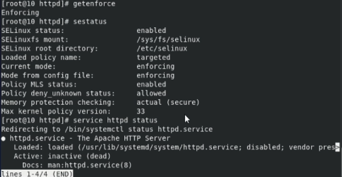
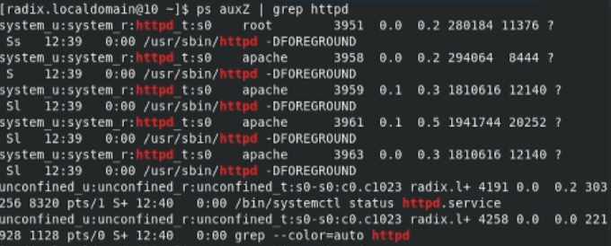
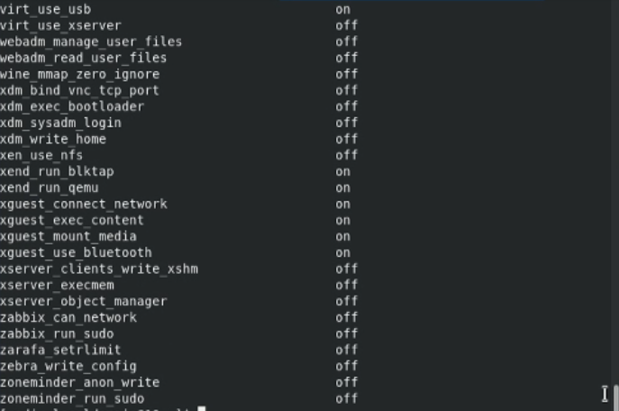
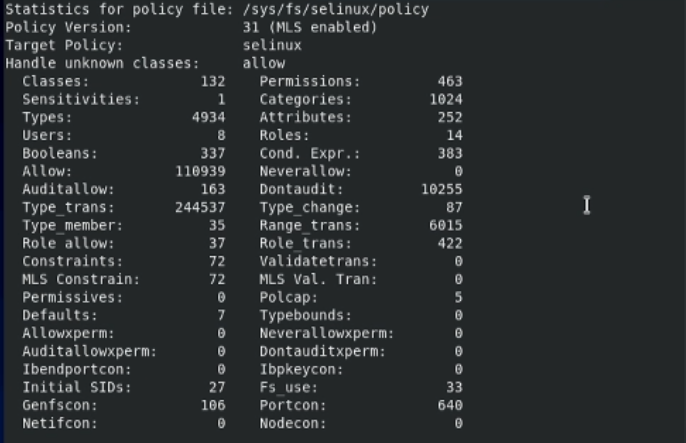
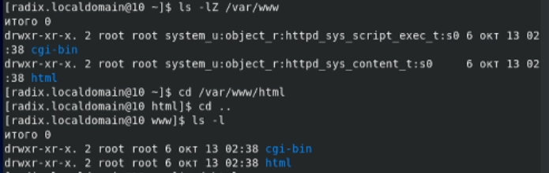
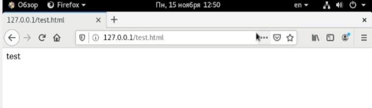
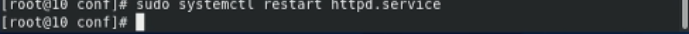
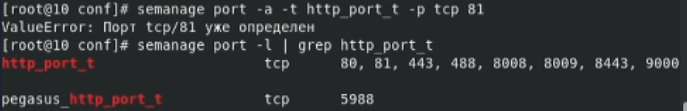
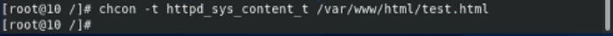
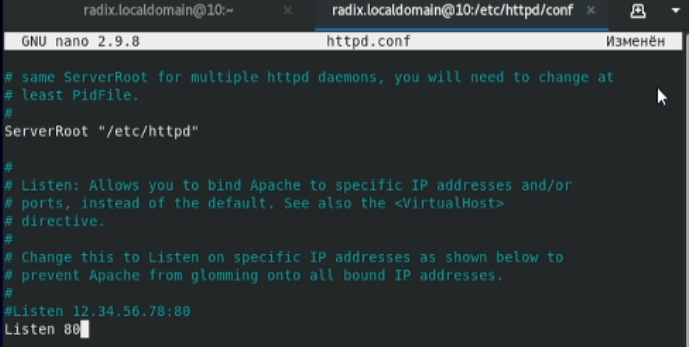

---
title: "Лабораторная работа № 6. Мандатное разграничение прав в Linux"
author: [Радикорский Павел Михайлович, НФИбд-03-18]
institute: "RUDN University, Moscow, Russian Federation"
date: "15.11.2021"
keywords: [Безопасность, Лабораторная]
lang: "ru"
toc-title: "Содержание"
toc: true # Table of contents
toc_depth: 2
lof: true # List of figures
fontsize: 12pt
mainfont: PT Serif
romanfont: PT Serif
sansfont: PT Sans
monofont: Consolas
mainfontoptions: Ligatures=TeX
romanfontoptions: Ligatures=TeX
sansfontoptions: Ligatures=TeX,Scale=MatchLowercase
monofontoptions: Scale=MatchLowercase
titlepage: true
titlepage-text-color: "000000"
titlepage-rule-color: "000000"
titlepage-rule-height: 0
listings-no-page-break: true
indent: true
header-includes:
  - \usepackage{sectsty}
  - \sectionfont{\clearpage}
  - \linepenalty=10 # the penalty added to the badness of each line within a paragraph (no associated penalty node) Increasing the value makes tex try to have fewer lines in the paragraph.
  - \interlinepenalty=0 # value of the penalty (node) added after each line of a paragraph.
  - \hyphenpenalty=50 # the penalty for line breaking at an automatically inserted hyphen
  - \exhyphenpenalty=50 # the penalty for line breaking at an explicit hyphen
  - \binoppenalty=700 # the penalty for breaking a line at a binary operator
  - \relpenalty=500 # the penalty for breaking a line at a relation
  - \clubpenalty=150 # extra penalty for breaking after first line of a paragraph
  - \widowpenalty=150 # extra penalty for breaking before last line of a paragraph
  - \displaywidowpenalty=50 # extra penalty for breaking before last line before a display math
  - \brokenpenalty=100 # extra penalty for page breaking after a hyphenated line
  - \predisplaypenalty=10000 # penalty for breaking before a display
  - \postdisplaypenalty=0 # penalty for breaking after a display
  - \floatingpenalty = 20000 # penalty for splitting an insertion (can only be split footnote in standard LaTeX)
  - \raggedbottom # or \flushbottom
  - \usepackage{float} # keep figures where there are in the text
  - \floatplacement{figure}{H} # keep figures where there are in the text
...

# Цели и задачи

**Цель:** Развить навыки администрирования ОС Linux. Получить первое практическое знакомство с технологией SELinux1. Проверить работу SELinx на практике совместно с веб-сервером Apache

# Выполнение

Вошли в систему с полученными учётными данными и убедились, что SELinux работает в режиме enforcing политики targeted с помощью команд getenforce и sestatus. Обратились с помощью консоли к веб-серверу, запущенному на вашем компьютере, запустили сервер
    
{ #fig:001 width=70% }

Нашли веб-сервер Apache в списке процессов, определили его контекст безопасности — unconfined_u, unconfined_r, unconfined_t
    
{ #fig:001 width=70% }

Посмотрите текущее состояние переключателей SELinux для Apache с помощью команды sestatus -b httpd

{ #fig:001 width=70% }

Посмотрели статистику по политике с помощью команды seinfo, также определили множество пользователей, ролей, типов

{ #fig:001 width=70% }

Определили тип файлов и поддиректорий, находящихся в директории /var/www

{ #fig:001 width=70% }

Создали от имени суперпользователя html-файл /var/www/html/test.html следующего содержания

{ #fig:001 width=70% }

Проверили контекст созданного вами файла. По умолчанию присваивается httpd_sys_content_t

{ #fig:001 width=70% }

Обратились к файлу через веб-сервер, введя в браузере адрес http://127.0.0.1/test.html. Убедились, что файл был успешно отображён

{ #fig:001 width=70% }

Проверили контекст файла, сопоставили их с контекстом файлов httpd

{ #fig:001 width=70% }

Измените контекст файла /var/www/html/test.html с httpd_sys_content_t на samba_share_t, попробовали получить доступ к файлу, получили ошибку

{ #fig:001 width=70% }

Просмотрели log-файлы веб-сервера Apache. Также просмотрели системный лог-файл: tail /var/log/messages

{ #fig:001 width=70% }

Попробовали запустить веб-сервер Apache на прослушивание ТСР-порта 81. Для этого в файле /etc/httpd/httpd.conf нашли строчку Listen 80 и заменили её на Listen 81

{ #fig:001 width=70% }

Выполнили перезапуск сервера Apache, сбоя не произошло

{ #fig:001 width=70% }

Выполнили команду semanage port -a -t http_port_t -р tcp 81, после этого проверили список портов командой semanage port -l | grep http_port_t, убедились, что порт 81 появился в списке.

{ #fig:001 width=70% }

Вернули контекст httpd_sys_cоntent__t к файлу /var/www/html/ test.html: chcon -t httpd_sys_content_t /var/www/html/test.html, получили доступ к файлу

{ #fig:001 width=70% }

Вернули обратно порт 80 в файле конфигурации

{ #fig:001 width=70% }

Удалили привязку http_port_t к 81 порту: semanage port -d -t http_port_t -p tcp 81, удалили файл test.html

{ #fig:001 width=70% }

#  Выводы

В результате выполнения работы я развил навыки администрирования ОС Linux, получил первое практическое знакомство с технологией SELinux